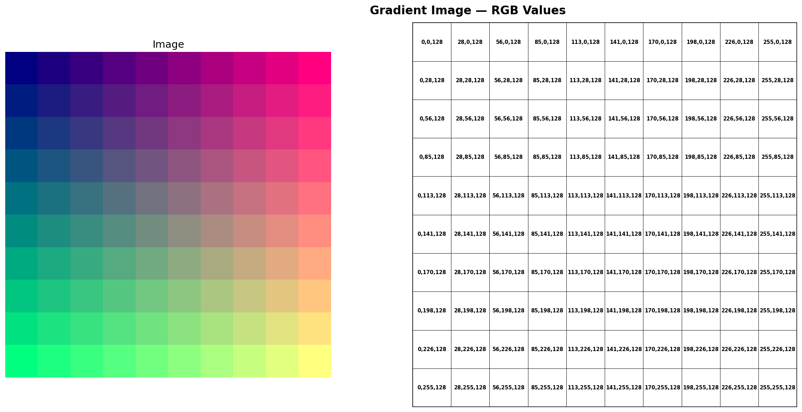
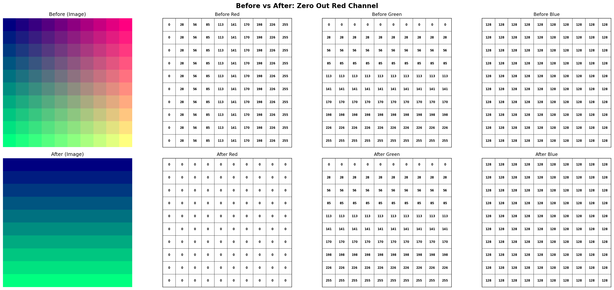
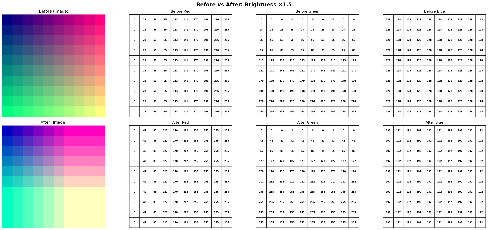

# NumPy Image Array Visualizer

A debugging and learning tool that lets you **see the actual numbers** behind image arrays. Built to develop intuition for how NumPy operations transform pixel data.

## Why This Exists

An image in NumPy is a 3D array with shape `(height, width, 3)` — rows × columns × RGB channels. This tool renders a 10×10 image as a grid of numbers alongside the visual output so you can trace exactly what each operation does.

## Key Concepts

```
Shape: (10, 10, 3)
         │    │   └── 3 channels: Red, Green, Blue
         │    └────── 10 columns (width)
         └─────────── 10 rows (height)

img[row, col, channel]  →  single value (0–255)
img[:, :, 0]            →  entire red channel
img[0]                  →  first row, all columns, all channels
```

## The Gradient Test Image

```python
img = np.zeros((10, 10, 3))
vals = np.linspace(0, 255, 10)

img[:, :, 0] += vals                          # Red:   gradient left → right
img[:, :, 1] += np.expand_dims(vals, axis=-1) # Green: gradient top → bottom
img[:, :, 2] += 128                           # Blue:  constant everywhere
```



Each cell shows `R,G,B` values. The four corners demonstrate additive color mixing:

| Corner       | R   | G   | B   | Color         |
| ------------ | --- | --- | --- | ------------- |
| Top-left     | 0   | 0   | 128 | Dark blue     |
| Top-right    | 255 | 0   | 128 | Pink/Magenta  |
| Bottom-left  | 0   | 255 | 128 | Mint/Aqua     |
| Bottom-right | 255 | 255 | 128 | Pastel yellow |

## Visualizing Operations

### Zero out the Red Channel

```python
after = img.copy()
after[:, :, 0] = 0
show_before_after(before, after, "Zero Out Red Channel")
```



### Brightness ×1.5

```python
after = np.clip(img * 1.5, 0, 255)
show_before_after(img, after, "Brightness ×1.5")
```



Notice how `np.clip` caps values at 255 — pixels that were already bright get **clipped**, losing detail. This is visible in the numbers.
